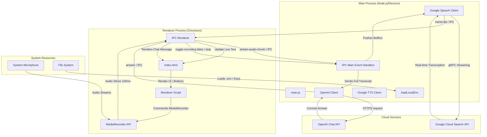
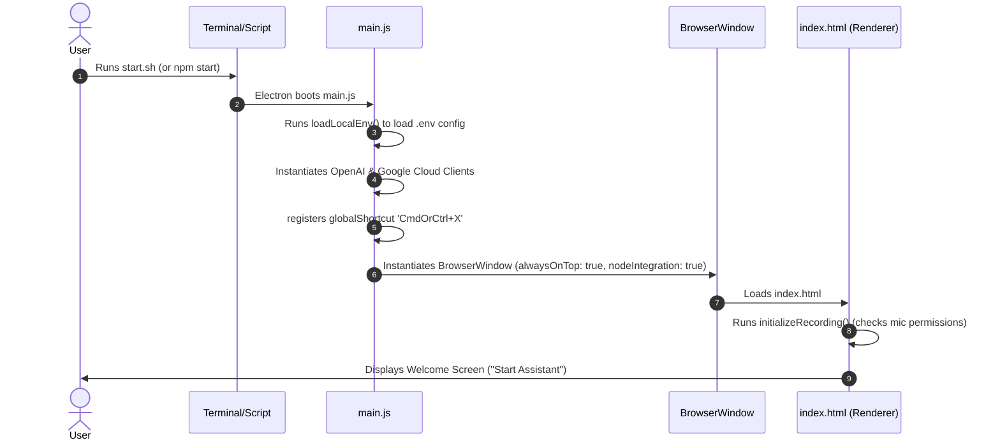
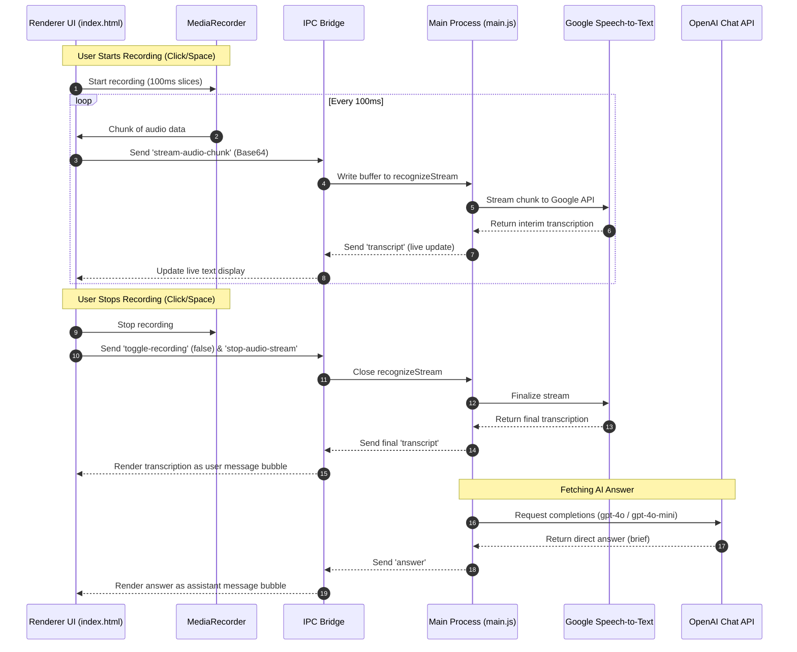

# PROJECT ANALYSIS: aaksAi AI Meeting Assistant

This document contains a comprehensive technical analysis of the `aaksAi` application, outlining its purpose, architecture, data flows, environment details, dependencies, security status, and recommendations.

---

## 1. Project Purpose

* **Application Overview:** `aaksAi` is a desktop utility that acts as an **AI-powered Meeting Assistant** designed to run alongside video conferencing tools (Zoom, Microsoft Teams, Google Meet, etc.). It displays transcripts and generates quick context-aware answers to queries in real-time.
* **Target Users:** Professionals, remote workers, students, and coordinators who require hands-free assistance during meetings for live reference notes, quick summaries, or answers.
* **Key Capabilities:**
  - **Always-on-Top Floating Window:** The UI stays pinned on top of other workspace windows.
  - **Real-Time Transcription:** Displays speech-to-text transcription live as the user or other participants speak.
  - **Contextual AI Answering:** Generates highly structured, concise, and direct solutions via OpenAI models upon stopping the transcription or on-demand.
  - **Direct Manual Chat:** Allows the user to type manual questions and choose between OpenAI models (`gpt-4o` and `gpt-4o-mini`).
  - **Exclusion from Screen Capture:** A toggle option to hide the application window from screenshots, video recordings, and screen shares to preserve privacy.
  - **Global Window Visibility Toggle:** Keybinding `CommandOrControl+X` toggles the application's visibility globally.

---

## 2. Architecture Analysis

### High-Level Architecture Diagram
The system is divided into an Electron Main Process (Node.js engine) and a Renderer Process (Chromium engine), communicating over standard Inter-Process Communication (IPC) channels:



### IPC Bridge & API Integrations
* **Audio Capture:** Performed within the renderer process via browser native `navigator.mediaDevices.getUserMedia`.
* **Streaming Transcription:** Audio slices (100ms intervals) are piped over IPC channel `stream-audio-chunk` to the main process, which forwards the raw buffers to Google Speech-to-Text gRPC streaming APIs.
* **AI Answering:** When recording stops, the accumulated transcripts are processed via OpenAI's Chat Completions endpoint. Responses are displayed within a structured chat container.
* **Content Protection:** Implemented using Electron's `setContentProtection(true)` on the `BrowserWindow` instance to prevent screen-capture hookups on OS levels.

---

## 3. Startup Flow

When launching the application, the execution sequence follows these specific milestones:



### Detailed Sequence
1. **Developer Environment Setup (`npm install`):** Fetches the dependencies and runs `postinstall`, triggering `electron-builder install-app-deps` to rebuild native modules (such as the binary interfaces) for matching binary compatibility with the local Electron runtime.
2. **Launch Execution (`./start.sh` or `npm start`):**
   * The `start.sh` script updates executable permissions (`chmod +x`) on build scripts and delegates to `npm start`.
   * `npm start` calls `electron .`, starting the Electron executable, which parses `package.json` and loads its declared entry file: `main.js`.
3. **Main Process Setup:**
   * Reads `.env` configuration keys into `process.env` dynamically via custom file parser `loadLocalEnv()`.
   * Resolves Google credentials via `getCredentialsPath()` and initializes client interfaces for `@google-cloud/speech`, `@google-cloud/text-to-speech`, and `openai`.
   * Listens for `app.whenReady()` to register a global keybinding (`CommandOrControl+X`) to toggle the visibility of the primary window.
4. **Window Creation & Initialization:**
   * Boots the `BrowserWindow` with direct Node execution access (`nodeIntegration: true`, `contextIsolation: false`) and keeps it floating (`alwaysOnTop: true`).
   * Loads `index.html`. The renderer code kicks in, immediately invoking `initializeRecording()` to check user microphone access.
   * Displays the Welcome Page. Once clicked, it displays the assistant layout.

---

## 4. File-by-File Breakdown

### Core Files

#### 1. [main.js](file:///Users/vishal/Desktop/MERN%20DEVLOPER/aaksAi/main.js)
* **Purpose:** The entry point of the Electron application running in the privileged Main Process.
* **Dependencies:** `electron`, `path`, `fs`, `@google-cloud/speech`, `@google-cloud/text-to-speech`, `openai`, `node-record-lpcm16`.
* **Imports:**
  - `@google-cloud/speech` for streaming transcribing API connections.
  - `openai` to interact with GPT-4 models.
* **Business Logic:**
  - `loadLocalEnv()`: Scans and loads keys from `.env` manually into environment values.
  - `createWindow()`: Spawns the always-on-top window interface.
  - `createRecognizeStream()`: Builds a gRPC write stream connection to Google Speech-to-Text API configured to process audio data formatted as `WEBM_OPUS` at a 48kHz sample rate.
  - IPC Listeners:
    - `toggle-recording`: Handles state switches between starting streams (clearing/initializing buffers) and stopping streams (completing transcriptions and requesting GPT completions).
    - `stream-audio-chunk`: Writes binary audio chunks received from renderer to the active Google Speech streaming pipe.
    - `toggle-screen-sharing-mode`: Activates OS-level screen shielding protection on the window.
    - `chat-message`: Invokes OpenAI Completions for manual chat requests with model selector options (`gpt-4o` and `gpt-4o-mini`).

#### 2. [index.html](file:///Users/vishal/Desktop/MERN%20DEVLOPER/aaksAi/index.html)
* **Purpose:** Handles the UI presentation and contains the renderer process javascript script.
* **Dependencies:** FontAwesome (styles), Google Fonts (Inter, Playfair Display), `ipcRenderer` (Electron integration).
* **Business Logic:**
  - Sets layout styles using CSS custom properties (`:root` theme variables).
  - Handles microphone audio capture via browser `navigator.mediaDevices.getUserMedia`.
  - Records audio chunks via `MediaRecorder` at 128kbps, slicing and pushing them via `stream-audio-chunk` every 100ms.
  - Receives live transcript updates over IPC to update the transcription dashboard.
  - Collects manually typed prompts and sends them to the main process via `ipcRenderer.invoke('chat-message')` to generate assistant replies.
  - Manages states for screen sharing modes, toggling visual cues (`#screenSharingIndicator`).

#### 3. [recording.js](file:///Users/vishal/Desktop/MERN%20DEVLOPER/aaksAi/recording.js)
* **Purpose:** Outlines a `RecordingService` designed to record audio via desktop audio capture frames.
* **Dependencies:** `electron` (specifically `desktopCapturer`).
* **Status:** **Unused/Dead Code.** The actual runtime recording flow is entirely handled in `index.html` using browser APIs.

### Setup and Build Files

#### 4. [scripts/setup-sox.js](file:///Users/vishal/Desktop/MERN%20DEVLOPER/aaksAi/scripts/setup-sox.js)
* **Purpose:** Ensures the presence of `sox` (Sound eXchange) binary inside node dependencies for audio formatting utilities.
* **Logic:** On macOS, installs `sox` via Homebrew (`brew install sox`) if missing, then copies the binary into the localized `node_modules/sox-bin` folder.

#### 5. [scripts/notarize.js](file:///Users/vishal/Desktop/MERN%20DEVLOPER/aaksAi/scripts/notarize.js)
* **Purpose:** Integrates with `@electron/notarize` during packaging stages on macOS.
* **Logic:** Validates if Apple credentials exist in the environment (`APPLE_ID`, `APPLE_TEAM_ID`, `APPLE_ID_PASSWORD`) and notarizes the compiled application for macOS distribution gatekeeper checks.

#### 6. [build.sh](file:///Users/vishal/Desktop/MERN%20DEVLOPER/aaksAi/build.sh) and [build-all.sh](file:///Users/vishal/Desktop/MERN%20DEVLOPER/aaksAi/build-all.sh)
* **Purpose:** Core automation scripts for local deployment.
* **Logic:** Cleans output caches, triggers `npm install`, runs `electron-rebuild` to compile native bindings, and triggers `electron-builder` to package builds for macOS ARM64 and Windows platforms without code signing (`CSC_IDENTITY_AUTO_DISCOVERY=false`).

---

## 5. Environment Variables

The application processes variables defined inside [`.env`](file:///Users/vishal/Desktop/MERN%20DEVLOPER/aaksAi/.env):

| Variable | Description | Where Used | Required Format / Values | Security Concerns |
| :--- | :--- | :--- | :--- | :--- |
| `OPENAI_API_KEY` | Authentication key for calling OpenAI models. | `main.js` (OpenAI initialization) | `sk-proj-...` | If leaked or hardcoded in source control, allows attackers to abuse your API quotas and billing. |
| `GOOGLE_APPLICATION_CREDENTIALS` | Path to Google Cloud Service Account JSON file. | `main.js` (Google Speech/TTS clients) | Relative or absolute path to a JSON credential file. | Grants full programmatic access to Google Cloud Speech APIs. Must be excluded from Git commits. |

> [!WARNING]
> **API Key Hardcoding Leak:** The actual `OPENAI_API_KEY` and Google Cloud service credentials (`aaksai-c62237f8e4eb.json`) are currently present inside the local repository root directory. These should be moved to secure storage or added to `.gitignore` to prevent leakage.

---

## 6. Electron Analysis & Security Configuration

### Window Properties & Security Risks
* **Always-on-Top:** Built using `alwaysOnTop: true`. On macOS, it executes custom logic:
  - `setVisibleOnAllWorkspaces(true, { visibleOnFullScreen: true })` ensures the window floats on top of presentation screens and full-screen meeting sessions.
* **Security Risk (Node Integration):** 
  - `webPreferences: { nodeIntegration: true, contextIsolation: false }`
  - In modern Electron, this is considered a **critical vulnerability**. Any code executing inside the renderer process (including user input or raw transcripts rendered directly) has full access to Node's runtime APIs (`require('child_process')`, access to filesystem, etc.).
  - **Remediation:** Implement `contextIsolation: true` and `nodeIntegration: false`, using a `preload.js` script to expose safe, specialized functions over the `contextBridge`.

### Content Protection (Screen Exclude)
* When Screen Sharing protection is activated (via the "Hide" toggle):
  - Calls `mainWindow.setContentProtection(true)`. This tells the OS compositing engine to obscure/blackout this window during screenshots, screen recordings, and desktop sharing streams.
  - macOS specific tweaks are applied to force redraw checks:
    - Setting window opacity to `0.99`.
    - Temporarily shifting the window bounds by 1 pixel and restoring them.
    - Toggling macOS `setVibrancy` options (`popover` then `null`) to trigger redraw cycles.

---

## 7. Recording System Detail

### Audio Capture Data Flow


### MediaRecorder API Specs
* **Constraints:** Microphone input is requested with default system configurations, optimizing voice clarity via:
  ```javascript
  { audio: { echoCancellation: true, noiseSuppression: true, autoGainControl: true, channelCount: 1 } }
  ```
* **MIME Format:** Prefers `'audio/webm;codecs=opus'`, falling back to standard `'audio/webm'` or `'audio/mp4'` depending on operating system support.
* **Transmission:** Chunks are sliced at `100ms` intervals to provide smooth real-time transcription updates.

---

## 8. AI Features & Fallback Logic

### Client Logic
* **Models Utilized:** Supports `gpt-4o` (Primary) -> `gpt-4o-mini` (Fast secondary) -> `gpt-3.5-turbo` (Legacy fallback).
* **Robust Fallback Loop:** When generating meeting answers on record stop, the application executes a fallback loop trying the models in priority order. If a model fails due to a network timeout, quota exhaustion (`429`), or invalid billing, it attempts the next model in the list.
* **Streaming Capability:** Supported for Speech-to-Text via Google gRPC streaming. Not currently supported for OpenAI chat answers (the UI shows a loading state until the complete response is returned).

---

## 9. Build and Packaging System

* **Packaging Engine:** Managed via `electron-builder` as declared in `package.json`.
* **ASAR Unpacking:** Unpacks specific modules that require access to internal native dependencies or localized files (`@google-cloud/text-to-speech`, `@google-cloud/speech`, `node-record-lpcm16`).
* **Cross-Platform Compilation:**
  - **macOS:** Builds disk image installer (`.dmg`) and zip archive target architectures (specifically macOS Apple Silicon using `--mac --arm64`). Integrates signature notarization when environment credentials are present.
  - **Windows:** Compiles standard NSIS installation package (`.exe`) and zip archive targets (`--win`).

---

## 10. Dependency Audit

Based on a review of `package.json`:

| Dependency | Purpose | Status | Recommendation |
| :--- | :--- | :--- | :--- |
| `@google-cloud/speech` | Provides real-time transcription. | **Active** | Keep. |
| `openai` | Generates meeting answers. | **Active** | Keep. |
| `@google-cloud/text-to-speech` | Intended for text-to-speech feedback. | **Unused / Dead Code** | Remove if TTS features are not required. |
| `axios` | Intended for making HTTP calls. | **Unused / Dead Code** | Remove since official SDK client is used. |
| `node-record-lpcm16` | Capture audio locally. | **Unused / Dead Code** | Remove since browser MediaRecorder API is used. |
| `electron` (v28.0.0) | Core framework runtime. | **Active** | Upgrade to current LTS (v30+) to patch security issues. |

---

## 11. Security Review & Vulnerability Assessment

1. **API Keys / Service Account Leak (Critical):**
   * **Finding:** Both `.env` (containing the active `OPENAI_API_KEY`) and `aaksai-c62237f8e4eb.json` (Google Cloud private service key credentials) are present in the project workspace directory.
   * **Remediation:** Remove these credential files from the workspace root or add them explicitly to `.gitignore` to prevent committing them to version control.
2. **Renderer Node Integration (High):**
   * **Finding:** `nodeIntegration: true` and `contextIsolation: false` are configured in `main.js`. If the transcription renders malicious input or raw text without sanitation, a malicious actor could exploit it to achieve Remote Code Execution (RCE).
   * **Remediation:** Enable `contextIsolation: true`, disable `nodeIntegration`, and use a `preload.js` script with `contextBridge` to interface safely.
3. **No HTTPS check or local CSP (Medium):**
   * **Finding:** There is no Content Security Policy (CSP) defined inside `index.html` to restrict script sources, leaving the app vulnerable to XSS vector attacks.
   * **Remediation:** Add a robust `<meta http-equiv="Content-Security-Policy" ...>` tag.

---

## 12. Performance & Resource Review

1. **Accumulating Blobs Memory Leak (Medium):**
   * **Finding:** During recording, `audioChunks` are continuously pushed into the memory array (`audioChunks.push(event.data)`). For long sessions, this consumes substantial memory until the recording is stopped and garbage collection runs.
   * **Remediation:** Clear processed buffer chunks from memory immediately after they are converted and sent to the main process, rather than keeping the entire list in memory.
2. **Synchronous File Loading (Low):**
   * **Finding:** `loadLocalEnv()` reads `.env` on startup using `fs.readFileSync`.
   * **Remediation:** Use asynchronous operations or rely on the standard `dotenv` package.
3. **Rendering Chat History (Low):**
   * **Finding:** Appends DOM nodes directly on message arrival. Very long chat transcripts will cause page lag.
   * **Remediation:** Implement a sliding display window or virtual lists for chat history.

---

## 13. Missing Features & Stubs

* **Dead Code Cleanup:**
  - `recording.js` is completely unused.
  - `@google-cloud/text-to-speech` is imported and instantiated as `ttsClient` in `main.js` but never used.
  - `node-record-lpcm16` and `axios` are listed as dependencies but never called.
* **AI Streaming:** OpenAI answers do not stream, forcing the user to wait for the complete block.
* **User Settings Interface:** Missing settings page to configure AI model selection, API key values, or custom system prompt instructions directly from the UI.

---

## 14. Summary of Key Recommendations

1. **Move Credentials out of Workspace:** Revoke the exposed keys/service account files if they are pushed, and add them to `.gitignore`.
2. **Refactor Electron Security Layer:** Add `preload.js`, set `contextIsolation: true`, and disable `nodeIntegration`.
3. **Implement OpenAI Streaming:** Update `chat-message` and record answering handlers to leverage streaming OpenAI completions for a faster, more premium user experience.
4. **Remove Dead Dependencies:** Clean up `recording.js`, `node-record-lpcm16`, `axios`, and `@google-cloud/text-to-speech`.
